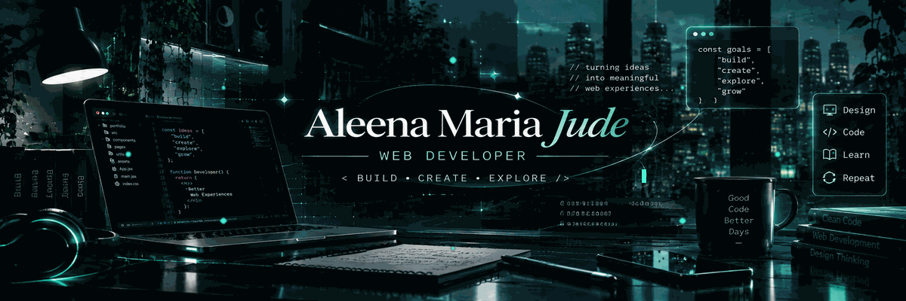

  

<h2>✦ ALEENA MARIA JUDE</h2>

<b>WEB DEVELOPER</b>

Turning ideas into clean, interactive web experiences.

<h3 align="center">⌘ TECHNOLOGY</h3>

  

<code>FRONTEND</code> &nbsp; <code>UI / UX</code> &nbsp; <code>DEVELOPMENT</code> &nbsp; <code>PROBLEM SOLVING</code>

<h3>◈ DEVELOPER MODE</h3>

<h3 align="center">◈ CONNECT</h3>

 

BUILD • CREATE • EXPLORE

