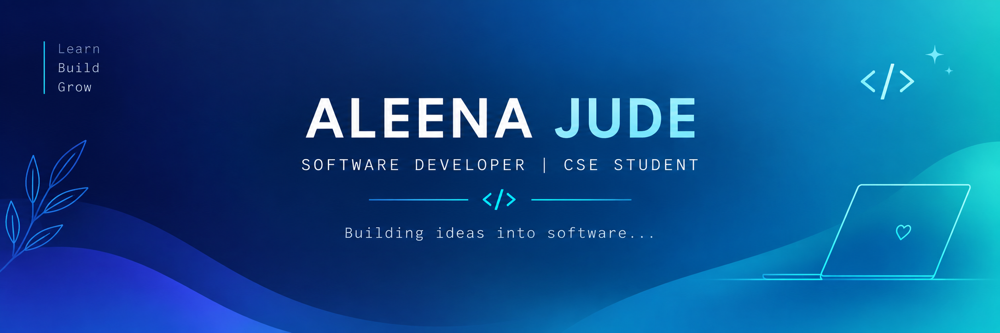

<div align="center">
  
</div>
<div align="center">

# 👩🏻‍💻 ALEENA JUDE

### SOFTWARE DEVELOPER | CSE STUDENT

*Building ideas into software...*

[](https://github.com/Aleena-Maria-Jude)
[](https://www.linkedin.com/in/aleena-maria-jude-58a3a7350?utm_source=share_via&utm_content=profile&utm_medium=member_android)

</div>

---

<table>
<tr>
<td width="50%" valign="top">

### 👋 Hi, I'm Aleena!

💻 CSE Student  
🌱 Learning Web Development  
💡 Interested in Software Development  
🏆 EmpowHER Ideathon — 2nd Prize  

**Currently learning**

- HTML
- CSS
- JavaScript
- Java

</td>
<td width="50%" valign="top">

### 💻 Developer Terminal

```text
$ whoami

Aleena Jude
CSE Student • Developer

$ mission

Build useful things.
Solve meaningful problems.

$ current_state

Learning → Building → Improving
```

</td>
</tr>
</table>

---

### 🛠️ Tech Stack

<div align="center">


</div>

### 🚀 My Projects

- 🌐 **Personal Portfolio** — Coming soon
- 🍽️ **Smart Campus Canteen Management System** — A project to improve campus canteen queues and ordering.

### 📊 GitHub Stats


---

<div align="center">

✨ *Learn. Build. Create. Repeat.* ✨

</div>
